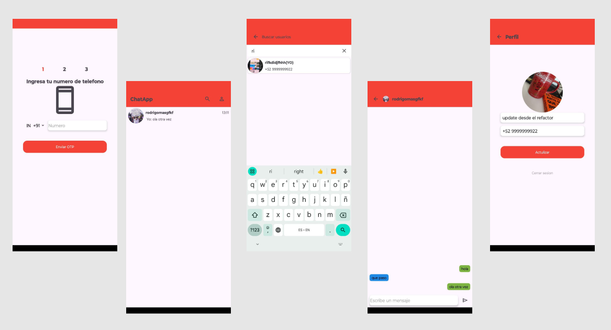

# 💬 ChatApp

- Aplicación de chat para Android con autenticación por número de teléfono, mensajería
en tiempo real y envío de archivos, construida sobre Firebase con arquitectura MVVM.

<p align="center">

</p>

---

## ✨ Características
 
- 📱 **Autenticación por SMS** con Firebase Auth (verificación OTP por número de teléfono)
- 💬 **Mensajería en tiempo real** con Cloud Firestore
- 📎 **Envío de archivos e imágenes** con Firebase Storage
- 🧭 **Navegación de una sola Activity** con Navigation Component
- 🎨 **Splash Screen** con la API oficial de AndroidX


---
 
## 🏗️ Arquitectura
 
El proyecto sigue **MVVM** con separación por capas:
 
```
app/src/main/java/
├── data/          # Servicios de Firebase (Auth, Firestore, Storage) y repositorios
├── di/            # Módulos de Dagger
├── ui/
│   ├── login/     # Flujo de autenticación por teléfono (Fragment + ViewModel)
│   └── chat/      # Listado y detalle de conversaciones
└── common/
```

---

## ⚙️ Tecnologías
 
| Categoría | Tecnologías |
|---|---|
| Lenguaje | Kotlin |
| UI | Fragments · Navigation Component · SplashScreen API |
| Arquitectura | MVVM · ViewModel · Clean Code |
| Backend | Firebase Auth (phone) · Cloud Firestore · Firebase Storage |
| Inyección de dependencias | Dagger |
| Testing | JUnit · Mockito · Robolectric |
| CI | GitHub Actions |


---
## 🚀 Instalación
 
**Requisitos:** Android Studio (Ladybug o superior), JDK 17, una cuenta de Firebase.
 
1. Clona el repositorio:
```bash
   git clone https://github.com/srodevs/ChatApp.git
```
 
2. Crea un proyecto en [Firebase Console](https://console.firebase.google.com) y
   registra la app con el `applicationId` del proyecto.
3. Habilita en la consola:
   - **Authentication** → método *Teléfono*
   - **Cloud Firestore**
   - **Storage**
4. Descarga `google-services.json` y colócalo en:
```
   ChatApp/app/google-services.json
```

5. Sincroniza Gradle y ejecuta.
---
 
## 🧪 Probar sin consumir SMS reales
 
Firebase limita la cantidad de SMS de verificación por día. Para desarrollar sin
gastar esa cuota, usa los **números de prueba** que ofrece la propia consola:
 
> Firebase Console → Authentication → Sign-in method → Phone → *Números de teléfono
> para la prueba*
 
Agrega un número ficticio (ej. `+52 9999999922`) con un código fijo (ej. `222222`).
Con eso el flujo completo funciona sin enviar un SMS real.
 
<details>
<summary>Atajos adicionales para depurar el flujo de verificación</summary>
Si necesitas saltarte la entrada manual del código durante el desarrollo, el proyecto
permite forzar la auto-recuperación del OTP en `data/AuthFirebaseService.kt`:
 
```kotlin
fun loginPhone() {
    // Solo para desarrollo: fuerza el código del número de prueba
    firebaseAuth.firebaseAuthSettings
        .setAutoRetrievedSmsCodeForPhoneNumber("+52 9999999922", "222222")
}
```
</details>
---
 
## 📄 Licencia
 
Distribuido bajo licencia MIT. Ver [`LICENSE`](LICENSE) para más detalles.
 


